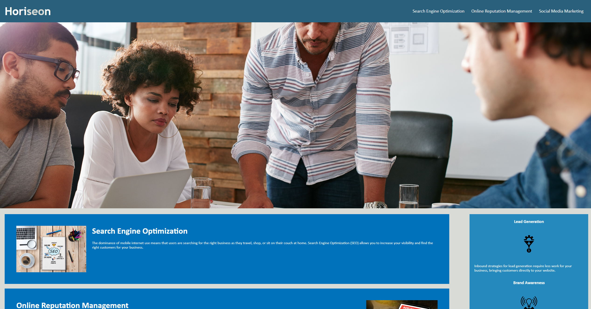
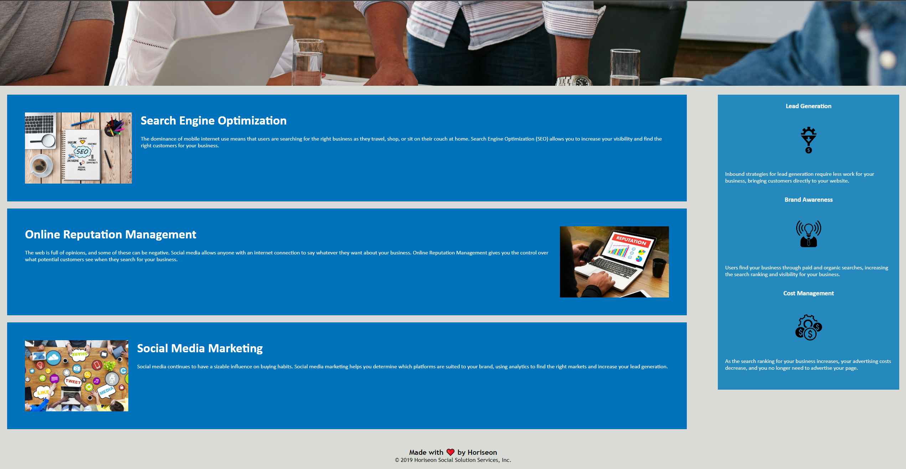

# mock-up-landingpage
This is a landing page of mock website called Horiseon. 

In this page I've made several changed that include:

     *Changed the div classes to use semantic HTML elements instead

     *Added alt discriptions to all the photos used in the site

     *Consolidated much of the CSS to make the page more organized

